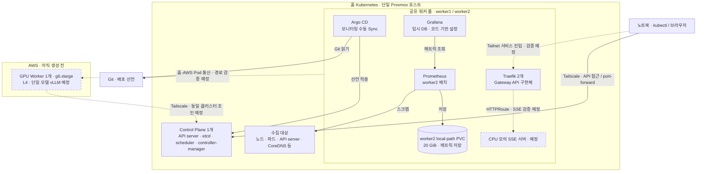

# persona-platform

Persona Runtime의 Kubernetes·AWS 인프라와 배포 구성을 관리하는 저장소다.
홈 Kubernetes에 AWS GPU 워커를 연결해, LLM 서빙 환경을 구축하고 관측·성능 개선 실험을 지원한다.

## 주요 구성

| 영역 | 구성 |
| --- | --- |
| 클러스터 | 홈 Control Plane 1개 + 공유 Worker 2개, AWS GPU Worker 1개 추가 예정 |
| 네트워크 | Tailscale + Cilium VXLAN, kube-proxy 유지 |
| 라우팅 | Traefik + Gateway API, Tailnet 전용 접근 목표 |
| 배포 관리 | Terraform · Helm · Argo CD |
| 최소 모니터링 | Prometheus · Grafana · kube-state-metrics · node-exporter |
| LLM 서빙 | 단일 GPU·단일 모델의 vLLM 서빙 예정 |

일반 워크로드는 두 홈 워커를 공유하고, GPU 워크로드는 GPU 노드에 배치한다.
local-path 저장소는 노드에 종속되며, 고가용성은 현재 목표가 아니다.

## 인프라 아키텍처

실선은 현재 구성, 점선은 추가 예정인 연결이다. 워커 영역은 고정 Pod 위치가 아닌 배치 원칙을 나타낸다.

홈 Pod 통신은 Cilium VXLAN과 kube-proxy를 사용한다. 노드 InternalIP는 현재 LAN 주소이며,
AWS 연결 전 양방향 경로·MTU 검증이 필요하다. 관리 UI는 현재 port-forward로 접근한다.
controller-manager·scheduler·etcd·kube-proxy의 전용 메트릭 수집은 보류한다.

## 이 저장소의 역할

- AWS 자원과 Kubernetes 배포 선언 관리
- 네트워크·스토리지·접근 권한 구성
- 인프라 설치·검증·운영 절차 관리

애플리케이션 로직은 각 서비스 저장소에서, 부하 테스트와 장애 분석은 `persona-ops-lab`에서 관리한다.

## 진행 방향

홈 최소 모니터링 → CPU 모의 서빙·SSE 검증 → GPU 연결 → vLLM 성능 기준선 → 병목 개선.

현재 홈 모니터링을 구성했으며, 다음 단계는 CPU 모의 서빙이다.
AWS GPU 연결과 실제 LLM 서빙은 아직 진행 전이다.

## 관련 문서

- [전체 기획](../docs/current-plan.md)
- [실행 계획](../docs/execution-roadmap.md)
- [설계 트레이드오프](../tradeoff/README.md)
- [AWS GPU 준비](terraform/envs/prod/README.md)
