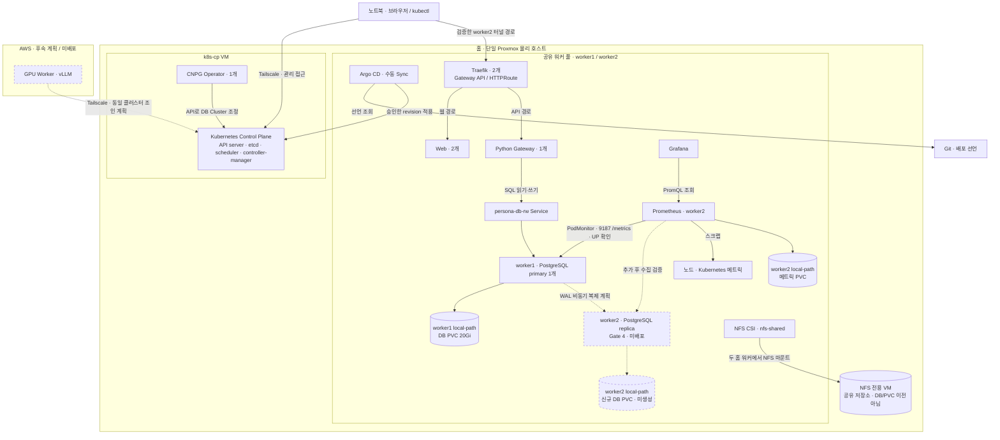

# persona-platform

Persona Runtime의 Kubernetes·네트워크·스토리지·배포 선언과 운영 절차를 관리한다.
애플리케이션 코드와 DB 테이블 migration은 각 서비스 저장소가 담당한다.

## 운영 구성

2026-09-17 사용자 제공 조회·검증 결과 기준이다. 현재 작업 트리의 선언이 모두 적용된 상태는 아니다.

| 구성          | 확인된 운영 상태                                 |
| ------------- | ------------------------------------------------ |
| 홈 환경       | Proxmox 한 대, Kubernetes CP 1대·워커 2대        |
| 네트워크      | Tailscale, Cilium VXLAN + kube-proxy             |
| 진입·웹       | Traefik 2개, Web 2개, Gateway 1개                |
| PostgreSQL    | CNPG 관리, worker1에 DB 1개·local-path 20Gi      |
| CNPG Operator | CP 배치·리더 인계·초기 안정성 확인               |
| 관측          | Prometheus·Grafana, DB PodMonitor Target UP 확인 |
| 공유 저장소   | 별도 NFS VM과 nfs-shared. DB 이전 용도가 아님    |
| AWS GPU       | 연결·서빙은 후속 작업                            |

단일 물리 호스트와 CP는 장애 지점이다. 워커 분산을 물리 장애까지 견디는 HA로 표현하지 않는다.
Prometheus local-path는 worker2에 종속되며 DB 복제로 해결되지 않는다.

## 인프라 구성도

실선은 확인된 구성·연결, 점선은 미배포 계획이다. 공유 워커 풀 안의 앱은 배치 후보를
나타내며, 노드마다 정확히 하나씩 실행된다는 뜻은 아니다. 웹 검증은 worker2 Traefik으로
고정한 터널 경로를 사용했다. 일반 서비스 진입 경로 전체의 장애 내성을 검증한 것은 아니다.



홈 Pod 네트워크는 Cilium VXLAN과 kube-proxy를 사용한다. AWS 연결·vLLM 호출 경로는 아직
검증하지 않았다. DB 복제본은 별도 로컬 볼륨을 사용하며, 기존 DB 디스크를 공유하거나 옮기는
방식이 아니다. 두 DB가 생겨도 같은 Proxmox 호스트의 장애까지 견디지는 못한다.

## 진행 중인 변경

- DB 백업·격리 복원과 단일 worker1 종료·재기동 기준선 검증을 마쳤다.
- 독립 PodMonitor는 Argo로 배포했고 CNPG 메트릭 수집을 확인했다.
- 작업 트리에는 DB 2인스턴스·필수 워커 분산 선언을 준비 중이다. **마지막 운영 확인은 DB 1개다.**
- 복제본 초기 추격·승격·쓰기 유실 검증은 아직 완료하지 않았다.

복구 실험에서 확인한 기존 캐릭터 ID 보존을 전체 데이터 무결성이나 RPO 0 보장으로 확대하지 않는다.
Operator의 CP 배치는 일반 앱 CP 배치 금지 원칙의 제한적 예외다.

## 배치·저장소 원칙

- 일반 앱은 두 홈 워커를 사용한다. Web·Traefik의 분산 선호는 노드당 정확히 하나를 보장하지 않는다.
- DB 복제 변경안은 두 홈 워커만 허용하고 필수 anti-affinity로 DB를 분산한다.
- local-path 데이터는 다른 노드로 자동 이동하지 않는다.
- PVC 요청 크기를 디렉터리의 실제 quota로 간주하지 않는다.
- Retain은 데이터 보존 정책이지 백업이 아니다.
- requests·limits 합계와 실사용량은 다르다. 롤아웃 중 추가 Pod와 장애 시 경합도 따로 확인한다.

## 로컬 검증

이 저장소 루트에서 실행한다. kubectl의 로컬 Kustomize 렌더, Ruby, 셸 등
각 스크립트가 요구하는 도구가 필요하다. 아래 명령은 운영 Sync를 수행하지 않는다.

```sh
kubectl kustomize kustomize/overlays/prod/persona-db
sh scripts/validate-persona-app-manifests.sh
bash scripts/test-persona-scheduling.sh
```

렌더·정책 검사 성공은 실제 스케줄링, 무중단 배포, 메트릭 수집 성공의 증거가 아니다.
Secret 값이나 실제 사용자 자료를 렌더 결과·로그·Git에 넣지 않는다.

## 운영 변경 절차

1. 실제 context·대상·현재 상태와 백업·복구 수단을 확인한다.
2. 선언 diff와 로컬 검사 결과를 검토한다.
3. 사용자가 CP에서 server dry-run을 수행한다.
4. 승인한 변경만 커밋·게시하고 Argo diff를 확인한다.
5. 지정한 revision을 수동 Sync하고 서비스·데이터·관측 상태를 검증한다.

DB Application의 Sync에 앱 migration이나 무관한 변경을 섞지 않는다.
Operator는 bootstrap 직접 설치 대상으로 DB Application과 관리 방식이 다르다.
PVC/PV 삭제·노드 장애 주입·클라우드 자원 생성은 각각 별도 승인 대상이다.
