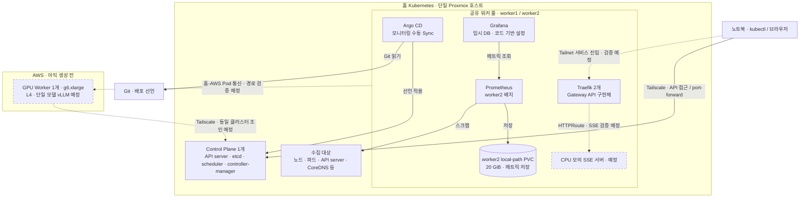

# persona-platform

Persona Runtime의 Kubernetes·AWS 인프라와 배포 구성을 관리하는 저장소다.
홈 Kubernetes에 AWS GPU 워커를 연결해, LLM 서빙 환경을 구축하고 관측·성능 개선 실험을 지원한다.

## 주요 구성

| 영역 | 구성 |
| --- | --- |
| 클러스터 | 홈 Control Plane 1개 + 공유 Worker 2개, AWS GPU Worker 1개 추가 예정 |
| 네트워크 | Tailscale + Cilium VXLAN, kube-proxy 유지 |
| 라우팅 | Traefik + Gateway API, Tailnet 전용 접근 목표 |
| 배포 관리 | Terraform · Helm · Argo CD |
| 최소 모니터링 | Prometheus · Grafana · kube-state-metrics · node-exporter |
| LLM 서빙 | 단일 GPU·단일 모델의 vLLM 서빙 예정 |

일반 워크로드는 두 홈 워커를 공유하고, GPU 워크로드는 GPU 노드에 배치한다.
local-path 저장소는 노드에 종속되며, 고가용성은 현재 목표가 아니다.

## 스케줄링 전략

**Kubernetes 기본 스케줄러를 사용하되, 아래 배치 규칙을 직접 추가했다.** 커스텀 스케줄러나
스케줄러 플러그인을 도입한 것은 아니다. `kubernetes.io/hostname`은 기본 노드 라벨이지만,
그 라벨로 특정 노드를 허용·제외하는 조건은 프로젝트의 설계다. namespace 분리는 관리 경계이며
노드 배치를 나누는 규칙은 아니다.

아래는 **2026-09-11 저장소 선언 기준**이다. Postgres·migration·Gateway·Web은 홈 배포 전이며,
기존 구성도 실제 적용된 값과의 일치 여부는 별도로 확인해야 한다.

### 어디에 배치하는가

| 대상 | 직접 추가한 규칙 | 의미 |
| --- | --- | --- |
| Postgres 1개 | `nodeSelector`: `k8s-worker1` | worker1에서만 실행. local-path PV도 해당 노드에 종속 |
| Gateway 1개·migration Job | 필수 `nodeAffinity`: worker1 또는 worker2 | 두 홈 워커 중 선택. CP·향후 GPU 노드는 제외 |
| Web 2개 | 홈 워커 제한 + 선호 `podAntiAffinity`, weight 100 | 가능하면 서로 다른 워커에 배치하되, 같은 노드에 함께 배치될 수도 있음 |
| Traefik 2개 | 홈 워커 제한 + 선호 `podAntiAffinity`, weight 100 | Web과 같은 분산 원칙. Web과 Traefik 사이의 분산을 요구하는 것은 아님 |
| Prometheus 1개 | `nodeSelector`: `k8s-worker2` | worker2에서 실행하며 메트릭 PVC도 해당 노드에 종속 |
| Grafana·kube-state-metrics·Prometheus operator | 홈 워커 제한 | worker1·2를 공유 |
| node-exporter | CP·worker1·worker2를 허용하는 affinity | 노드 관측용 DaemonSet. 일반 앱의 CP 제외 원칙과 구분 |

필수 조건을 만족하는 노드에 자원이 없으면 Pod는 Pending으로 남는다. 분산 선호는 강제가 아니며,
weight 100은 배치 확률 100%라는 뜻이 아니다. 노드 여유가 생겼다고 이미 실행 중인 Pod를
자동으로 다른 노드로 재분산하지도 않는다. DB 볼륨은 Pod 재생성만으로 다른 노드에 이동하지 않는다.

### 자원과 우선순위

- CPU·메모리 `requests`는 스케줄러가 노드에 자리를 배정할 때 사용하는 기준이다.
  `limits`는 실행 중 사용량을 제한한다. CPU 제한은 throttling, 메모리 제한은 OOM에 영향을 줄 수 있다.
  현재 수치는 초기 예산이며 부하 실측으로 확정한 값이 아니다.
- [커스텀 PriorityClass](bootstrap/priorityclasses/priorityclasses.yaml)는
  `persona-critical=1000000`, `persona-standard=1000`, `persona-low=100`이다.
  현재 DB 선언은 critical, Gateway·Web·Traefik 선언은 low를 참조한다. migration Job에는 명시하지 않았다.
- `preemptionPolicy`를 생략해 기본 선점 정책이 적용된다. 스케줄링할 공간이 부족하면
  조건에 따라 낮은 우선순위 Pod를 내보내고 높은 우선순위 Pod의 자리를 확보할 수 있다.
  `low`도 별도 기본 클래스가 없는 일반 Pod의 우선순위 0보다 높다.
- PriorityClass를 정의하는 것만으로 모든 관측 도구에 적용되지는 않는다. 현재 Prometheus values에는
  해당 클래스 참조가 없다. 따라서 **“관측·DB가 무조건 마지막까지 살아남는다”는 보장은 없다.**
  참조하는 클래스가 실제 클러스터에 존재하는지도 배포 전에 확인해야 한다.
- 현재 Postgres 선언은 메모리 request와 limit만 같고 CPU limit이 없어, 이 설정만으로
  Guaranteed QoS가 되지 않는다. PriorityClass와 QoS는 서로 다른 개념이다.

### 업데이트 정책 — 스케줄링과 구분

Gateway·Web에 `RollingUpdate`, `maxSurge: 0`, `maxUnavailable: 1`을 명시했다.
추가 Pod를 먼저 띄우기보다 기존 Pod 수를 줄이고 교체하는 선택이다.

- Gateway는 replica 1개라 업데이트 중 준비된 API가 없는 구간이 생길 수 있다.
- Web은 replica 2개라 정상적인 교체 중 하나를 유지하도록 하지만, 다른 장애까지 포함한 무중단 보장은 아니다.

**커스텀 우선순위·선점 유지 여부와 Gateway 업데이트 중 중단 허용 여부는 배포 전 재확인할 판단 사항이다.**
이 설명 추가는 기존 배포 옵션을 변경하거나 새 정책을 승인한 것이 아니다.

선언 위치: [Postgres](kustomize/base/persona-db/cluster.yaml),
[Gateway](kustomize/base/persona-gateway/deployment.yaml),
[Web](kustomize/base/persona-web/deployment.yaml),
[migration](kustomize/base/persona-migrate/job.yaml),
[Traefik](bootstrap/traefik/values.yaml), [모니터링](helm/values/monitoring-stack.yaml).

## 인프라 아키텍처

실선은 현재 구성, 점선은 추가 예정인 연결이다. 워커 영역은 고정 Pod 위치가 아닌 배치 원칙을 나타낸다.

홈 Pod 통신은 Cilium VXLAN과 kube-proxy를 사용한다. 노드 InternalIP는 현재 LAN 주소이며,
AWS 연결 전 양방향 경로·MTU 검증이 필요하다. 관리 UI는 현재 port-forward로 접근한다.
controller-manager·scheduler·etcd·kube-proxy의 전용 메트릭 수집은 보류한다.

## 이 저장소의 역할

- AWS 자원과 Kubernetes 배포 선언 관리
- 네트워크·스토리지·접근 권한 구성
- 인프라 설치·검증·운영 절차 관리

애플리케이션 로직은 각 서비스 저장소에서, 부하 테스트와 장애 분석은 `persona-ops-lab`에서 관리한다.

## 진행 방향

홈 최소 모니터링 → CPU 모의 서빙·SSE 검증 → GPU 연결 → vLLM 성능 기준선 → 병목 개선.

현재 홈 모니터링을 구성했으며, 다음 단계는 CPU 모의 서빙이다.
AWS GPU 연결과 실제 LLM 서빙은 아직 진행 전이다.

## 관련 문서

- [전체 기획](../docs/current-plan.md)
- [실행 계획](../docs/execution-roadmap.md)
- [설계 트레이드오프](../tradeoff/README.md)
- [AWS GPU 준비](terraform/envs/prod/README.md)
