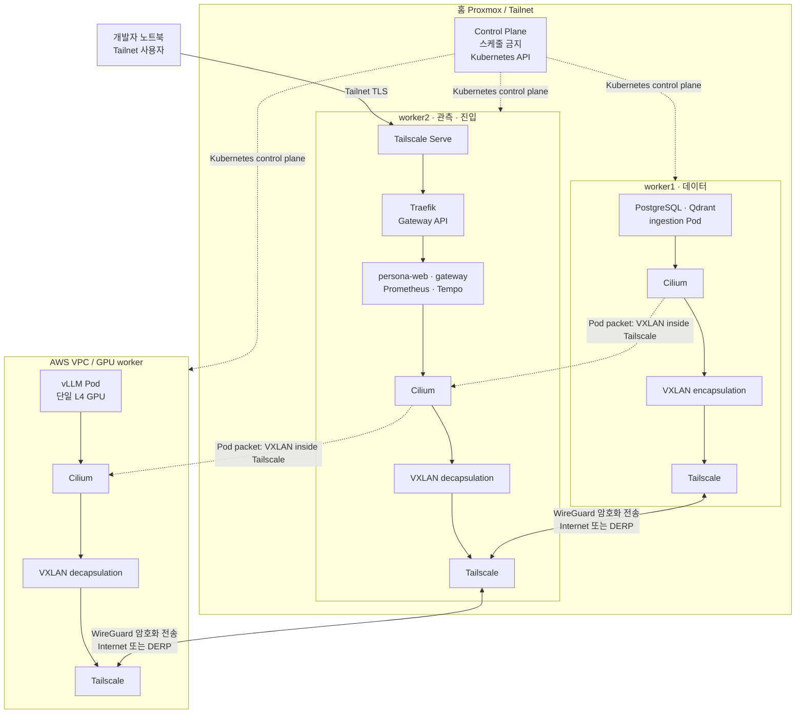

# persona-platform

AWS GPU worker와 home Kubernetes의 desired state를 GitOps로 관리한다.
**인프라·배포·보안 정책은 이 레포만 소유한다.**

기획 문서: [`docs/repository-plans/persona-platform.md`](../docs/repository-plans/persona-platform.md)

## 디렉토리

```
terraform/
├── modules/            # VPC, EC2 GPU worker, IAM, SG, Secrets Manager
└── envs/prod/
bootstrap/              # Tailscale one-off auth key, SSM, kubeadm join runbook
helm/values/            # Traefik, Argo CD, GPU Operator, Qdrant, kube-prometheus-stack
kustomize/
├── base/{persona-web,persona-gateway,persona-ingestion,vllm,qdrant,networkpolicy,gateway-api}
└── overlays/prod/
argocd/                 # Application 정의, image digest promotion
policy/tailscale/       # grants + policy test
runbooks/               # backup/restore, 장애 대응
```

## 고정 아키텍처 (v1)

- 홈 Control Plane 1 + 홈 Worker 2 + AWS GPU Worker 1 — 단일 클러스터
- Tailscale = node underlay, 기존 CNI = Pod data plane
- AWS GPU worker: `g6.xlarge` 우선, vLLM 1 replica, `tensor_parallel_size=1`
- GPU AMI가 NVIDIA driver/toolkit 소유 → GPU Operator는 `driver.enabled=false`, `toolkit.enabled=false`
- **public inbound 0.** SSM은 break-glass. public ingress / Funnel / SSH / API / metrics / NodePort 노출 금지
- Tailscale Serve → Traefik Gateway API → `persona-web` / `persona-gateway`만 Tailnet에 노출

## 네트워크 경로



Pod 간 패킷은 **Cilium VXLAN 오버레이**로 캡슐화되고, 그 바깥 패킷이
**Tailscale WireGuard 언더레이**를 타고 노드 사이를 이동한다. 반면 사용자의 HTTP
요청은 Tailnet에서 Tailscale Serve로 들어와 Traefik과 Gateway로만 전달된다. 인터넷에
Kubernetes API, NodePort, vLLM, 데이터베이스 포트를 직접 열지 않는다.

## 하지 않는 것

- CNI migration, Multus / SR-IOV / RDMA, distributed inference
- cluster/GPU autoscaling, Spot, HA, public TLS domain
- app business logic, parser 구현, dashboard query 구현

## 구현 루프

1. inventory & guardrails — LAN/VPC/Tailnet/Pod/Service CIDR 비중첩과 CNI flow 문서화
2. AWS bootstrap — public inbound 0, least-privilege, GPU quota/AZ capacity 확인
3. worker join & CNI gate — TLS SAN, Node InternalIP, EndpointSlice, PMTU 정렬 후 e2e
4. GPU serving platform — GPU Operator/DCGM/vLLM/Gateway API/NetworkPolicy
5. GitOps & recovery — Argo CD manual sync, digest promotion, restore dry-run

## 안전 규칙

CNI/MTU 실험은 disposable/canary 환경과 maintenance window에서만 실행하고,
rollback commit과 recovery 증거를 남긴다.
비밀(kubeconfig, 인증서, Tailscale auth key, tfvars, tfstate)은 커밋하지 않는다.

현재 상태: 뼈대만 존재.
