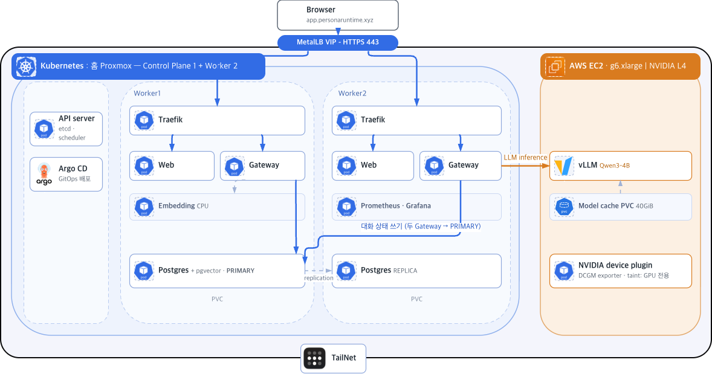

# persona-platform

Persona Runtime의 Kubernetes·네트워크·스토리지·배포 선언과 운영 절차를 관리한다.
애플리케이션 코드와 DB 테이블 migration은 각 서비스 저장소가 담당한다.

## 운영 구성

2026-09-18 사용자 제공 조회·검증 결과 기준이다. 현재 작업 트리의 선언이 모두 적용된 상태는 아니다.

| 구성          | 확인된 운영 상태                                 |
| ------------- | ------------------------------------------------ |
| 홈 환경       | Proxmox 한 대, Kubernetes CP 1대·워커 2대        |
| 네트워크      | Tailscale, Cilium VXLAN + kube-proxy             |
| 진입·웹       | Traefik 2개, Web 2개, Gateway 1개                |
| PostgreSQL    | CNPG 관리, worker1 primary·worker2 replica, local-path 20Gi씩 |
| CNPG Operator | CP 배치·리더 인계·초기 안정성 확인               |
| 관측          | Prometheus·Grafana, DB PodMonitor Target UP 확인 |
| 공유 저장소   | 별도 NFS VM과 nfs-shared. DB 이전 용도가 아님    |
| AWS GPU       | 연결·서빙은 후속 작업                            |

단일 물리 호스트와 CP는 장애 지점이다. 워커 분산을 물리 장애까지 견디는 HA로 표현하지 않는다.
Prometheus local-path는 worker2에 종속되며 DB 복제로 해결되지 않는다.

## 인프라 구성도



구성도는 서비스 연결과 배치 개요를 나타내며, 실제 배포·장애 복구 검증 결과를 대신하지 않는다.
홈 워커와 DB 복제본은 같은 Proxmox 물리 호스트를 사용하므로 물리 호스트 장애까지 견디는 구성은 아니다.

## 진행 중인 변경

- DB 백업·격리 복원과 단일 worker1 종료·재기동 기준선 검증을 마쳤다.
- 독립 PodMonitor는 Argo로 배포했고 CNPG 메트릭 수집을 확인했다.
- worker1 primary·worker2 replica 2인스턴스 비동기 복제를 구성했다. primary·replica CONNECT,
  스트리밍 복제 상태(전송·flush·replay LSN 일치), Prometheus 두 Target UP을 확인했다.
- 복제 구성 중 `cnpg_metrics_exporter` 계정에 `persona_app` CONNECT 권한이 없어 지표 수집이
  실패한 것을 발견·해결했다(운영 primary에 적용, 복제로 replica에도 반영). 재현 절차는
  `db/grants/persona_cnpg_monitoring.sql` — 접속 방법·적용 순서·복원 revision 주의사항까지
  그 파일 자체의 주석에 있다(추적 대상이라 이 checkout만으로도 확인 가능). **신규 구축·논리
  복원 뒤에도 이 권한이 남는지는 실제로 다시 구축·복원해 보기 전까지 미검증이다.**
- 복제본 초기 추격·승격·쓰기 유실 검증은 아직 완료하지 않았다.
- **persona 폐기(2026-10-07, 브랜치 `chore/retire-persona`)**: persona 앱(Gateway·Web·embedding)·
  persona DB·그 NetworkPolicy·공개 Route와 NFS(`csi-driver-nfs`·`persona-nfs-storage`)의 Argo
  Application·선언을 Git에서 뺐다. 위 운영 구성 표와 DB 관련 항목은 폐기 전 기록이다.
  공개 Gateway(`public-gateway`)·TLS·`persona-edge`·vLLM·모델 캐시는 남기고, 다음 서비스 공개
  전까지 공개 주소에는 `maintenance-page`(정적 준비 중 페이지, 503)를 붙인다. 실제 리소스 삭제는
  사람이 runbook 순서로 따로 실행한다 — Argo가 수동 Sync·prune 없음이라 Git에서 빠져도 리소스는 남는다.

복구 실험에서 확인한 기존 캐릭터 ID 보존을 전체 데이터 무결성이나 RPO 0 보장으로 확대하지 않는다.
Operator의 CP 배치는 일반 앱 CP 배치 금지 원칙의 제한적 예외다.

## 배치·저장소 원칙

- 일반 앱은 두 홈 워커를 사용한다. Web·Traefik의 분산 선호는 노드당 정확히 하나를 보장하지 않는다.
- DB 복제 변경안은 두 홈 워커만 허용하고 필수 anti-affinity로 DB를 분산한다.
- local-path 데이터는 다른 노드로 자동 이동하지 않는다.
- PVC 요청 크기를 디렉터리의 실제 quota로 간주하지 않는다.
- Retain은 데이터 보존 정책이지 백업이 아니다.
- requests·limits 합계와 실사용량은 다르다. 롤아웃 중 추가 Pod와 장애 시 경합도 따로 확인한다.

## 로컬 검증

이 저장소 루트에서 실행한다. kubectl의 로컬 Kustomize 렌더, Ruby, 셸 등
각 스크립트가 요구하는 도구가 필요하다. 아래 명령은 운영 Sync를 수행하지 않는다.

```sh
kubectl kustomize kustomize/overlays/prod/maintenance-page
# 공개 Gateway 단일 소유·TLS·준비 중 페이지·persona-edge·Argo 공통 규칙
sh scripts/validate-public-gateway-manifests.sh
# 위 검사가 Gateway·TLS·edge 제거와 준비 중 페이지 결함을 실제로 잡는지 복사본으로 확인한다.
sh scripts/test-public-gateway-manifests.sh
sh scripts/validate-networkpolicy-manifests.sh
# mafest 데이터 층(DB draft·PodMonitor·적재 Job·Application·권한 SQL)과 그 음성 테스트
sh scripts/validate-mafest-data-manifests.sh
sh scripts/test-mafest-data-manifests.sh
bash scripts/argo-preflight.sh --self-test
# persona 폐기 인벤토리(읽기 전용, CP에서 실행) 스크립트를 가짜 kubectl로 확인한다.
bash scripts/test-inventory-persona-retire.sh
# monitoring-stack만 Helm chart를 네트워크로 받아 렌더한다. 오프라인에서는 돌지 않는다.
sh scripts/validate-monitoring-manifests.sh
# mem-lab 노드 선언: public Kubernetes port와 GPU runtime 유입을 막는다.
sh scripts/validate-mem-lab-declarations.sh
# 위 검사와 terraform test가 실제로 결함을 잡는지 복사본에 결함을 넣어 확인한다(terraform 필요).
sh scripts/test-mem-lab-negative.sh
```

렌더·정책 검사 성공은 실제 스케줄링, 무중단 배포, 메트릭 수집 성공의 증거가 아니다.
Secret 값이나 실제 사용자 자료를 렌더 결과·로그·Git에 넣지 않는다.

## 운영 변경 절차

1. 실제 context·대상·현재 상태와 백업·복구 수단을 확인한다.
2. 선언 diff와 로컬 검사 결과를 검토한다.
3. 사용자가 CP에서 server dry-run을 수행한다.
4. 승인한 변경만 커밋·게시하고 Argo diff를 확인한다.
5. 지정한 revision을 수동 Sync하고 서비스·데이터·관측 상태를 검증한다.

DB Application의 Sync에 앱 migration이나 무관한 변경을 섞지 않는다.
Operator는 bootstrap 직접 설치 대상으로 DB Application과 관리 방식이 다르다.
PVC/PV 삭제·노드 장애 주입·클라우드 자원 생성은 각각 별도 승인 대상이다.
