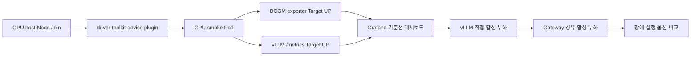
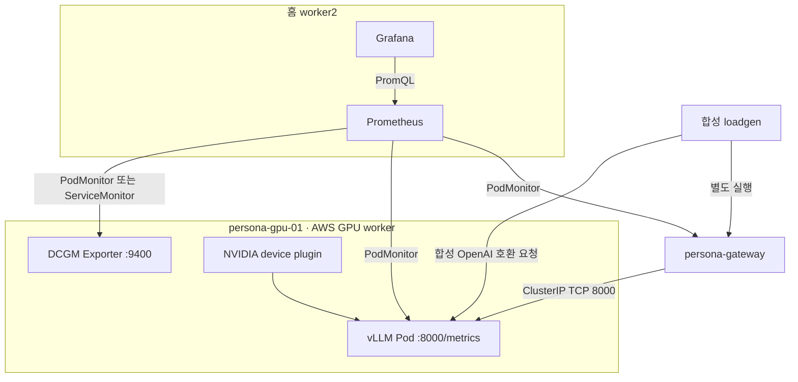

# vLLM GPU 기준선 — 관측·실험 계획

상태: **2026-09-21 선언 전 계획**. AWS GPU 인스턴스, Kubernetes Node, NVIDIA driver,
DCGM Exporter, vLLM, PodMonitor, 대시보드, 부하 생성기를 아직 배포하거나 실행하지 않았다.

이 문서는 [GPU 노드 사양·Join 계획](vllm-node-join-plan.md)의 다음 단계다. GPU가 보인다는
확인만으로는 서빙이 가능하거나 빠르다는 결론을 낼 수 없다. 먼저 수집 경로를 만들고
Target `UP`을 확인한 뒤에만 합성 부하·장애·실행 옵션 비교를 한다.

실험 입력은 합성 문자열과 정해진 길이만 사용한다. 사용자 질문, 문서 원문, 검색 본문,
Bearer token, 모델 접근 token, request ID를 메트릭 label·로그·대시보드·공개 결과에 넣지
않는다.

## 1. 범위와 소유권

| 영역 | 소유 레포 | 이 문서에서 정하는 것 | 이번에 구현하지 않는 것 |
| --- | --- | --- | --- |
| Kubernetes·Argo·NetworkPolicy·PodMonitor | `persona-platform` | 리소스 경계, Sync 순서, Target 통과 조건 | 매니페스트 작성·Sync |
| Gateway 계측 | `persona-gateway` | 필요한 요청·upstream 관측 계약 | 신규 metric·vLLM 호출 구현 |
| 부하 생성기·대시보드·실험 결과 | `persona-ops-lab` | 시나리오·입력 위생·필요 산출물 | loadgen·Grafana JSON·실험 실행 |
| GPU host | AWS GPU Node | driver/toolkit/DCGM/vLLM 조합 확인 | 인스턴스 생성·패키지 설치 |

`persona-ops-lab/docs/monitoring-inventory.md`는 관측 항목의 장기 목록이다. 그 문서의
Qdrant·GPU admission 관련 항목은 현재 서비스 구현으로 읽지 않는다. 현재 플랫폼의
검색 저장소 기준은 Postgres/pgvector이며, 이 문서는 **vLLM 기준선에 필요한 최소 계약**만
구체화한다.

## 2. 완료 순서와 중단 조건

| 게이트 | 통과 근거 | 하나라도 실패하면 |
| --- | --- | --- |
| O0 — 수집 선언 검토 | 리소스 소유 Application, label selector, NetworkPolicy, Sync 순서가 리뷰됨 | GPU instance 생성·Join은 진행할 수 있어도 vLLM 성능 실험은 시작하지 않는다 |
| O1 — GPU host | `nvidia-smi`, container GPU smoke, Node allocatable `nvidia.com/gpu: 1` | driver/toolkit/device plugin 문제를 해결한다. vLLM을 먼저 올리지 않는다 |
| O2 — 관측 Target | vLLM·DCGM 각각 Prometheus Target `UP`; GPU Node node-exporter 상태 확인 | 수집을 고친다. Grafana 화면만 보고 성공 처리하지 않는다 |
| O3 — 데이터 위생 | `/metrics`·로그에 prompt, token, 고유 request/persona/user 식별자가 없음 | 부하를 중단하고 label·logging을 수정한다 |
| O4 — 직접 기준선 | 고정 모델 revision/digest, 고정 합성 입력, warm-up 분리 결과 | Gateway·네트워크 경로 실험을 아직 섞지 않는다 |
| O5 — 서비스 기준선 | Gateway 경유 결과와 직접 기준선을 같은 조건으로 비교 | upstream·정책·DNS·Gateway 중 원인을 분리한다 |

`UP`은 수집 경로가 살아 있다는 뜻일 뿐 정확한 GPU 값·모델 성능·장애 복구를 보장하지
않는다. 반대로 `Node Ready`도 Pod 데이터 경로와 GPU 사용 가능의 증거가 아니다.

## 3. 수집 구조

Prometheus는 `monitoring` namespace의 기존 `monitoring-stack` Helm release가 제공한다.
그 Prometheus는 `release: monitoring-stack` label을 가진 PodMonitor/ServiceMonitor만
선택한다. vLLM·DCGM monitor에 이 label이 빠지면 리소스는 생겨도 scrape 대상이 되지
않는다. 기존 DB PodMonitor의 같은 label·30초 interval·10초 timeout을 선례로 삼되,
복사만 하고 실제 Pod label·port name을 추정하지 않는다.

### 3.1 새 리소스의 계획 경계

아래 표는 **선언해야 할 리소스 목록**이다. 이름과 selector는 선택한 chart/image의 실제
render 결과를 본 뒤 확정한다. 아직 파일을 만들지 않았으므로 적용된 구성으로 읽지 않는다.

| Application | namespace | 리소스 | 최소 선택 기준 | 수집 포트 |
| --- | --- | --- | --- | --- |
| `persona-inference` | `persona-inference` | Namespace, vLLM Deployment, ClusterIP Service, default-deny/allow 정책, vLLM PodMonitor | vLLM workload label 하나를 Deployment·Service·Policy·Monitor가 동일하게 사용 | TCP 8000 |
| GPU telemetry 전용 Application 또는 검토된 기존 소유 범위 | 별도 `gpu-monitoring` 후보 | GPU node만 선택하는 DCGM Exporter DaemonSet/Service/Monitor | `personaruntime.xyz/node-pool=gpu`와 GPU Node taint toleration | TCP 9400 |
| `persona-app-netpol` | `persona-app` | Gateway의 inference egress 정책 | Gateway label만 선택, inference Service의 TCP 8000만 허용 | TCP 8000 |
| `monitoring-stack` values | `monitoring` | GPU Node까지 node-exporter 배치 범위 확장 여부 | 현재 home 3 node 고정 affinity를 GPU Node에도 맞게 재설계 | node-exporter 기본 포트 |

`prometheus-node-exporter`는 현재 `k8s-cp`, `k8s-worker1`, `k8s-worker2`만 허용하는
nodeAffinity가 있다. GPU Node가 Join해도 Node CPU·memory·filesystem 지표가 자동으로
생기지 않는다. 이 값을 고치기 전에는 GPU host의 디스크/메모리 관측을 "Prometheus로
수집 중"이라고 표현하지 않는다.

DCGM Exporter는 GPU node마다 하나가 필요하고 Kubernetes에서는 daemonset 방식이
가능하다. exporter가 실제로 내는 metric은 선택한 collector CSV, driver, GPU, 권한에 따라
달라진다. 따라서 metric 이름은 배포 전 약속이 아니라 `/metrics`에서 실제로 확인한 뒤
대시보드와 규칙에 고정한다. [NVIDIA DCGM Exporter 설치 문서](https://docs.nvidia.com/datacenter/dcgm/latest/installation/install-dcgm-exporter.html)

### 3.2 NetworkPolicy와 노출 경계

vLLM의 `/metrics`는 API와 같은 8000 포트에서 제공되므로, `persona-inference` default-deny
상태에서는 두 ingress 경로를 분리해 명시한다.

1. `persona-app`의 `persona-gateway` → vLLM Pod TCP 8000: 실제 inference 요청.
2. `monitoring`의 실제 Prometheus Pod → vLLM Pod TCP 8000: `/metrics` scrape.

DCGM도 `monitoring`의 실제 Prometheus Pod에서 TCP 9400으로 오는 ingress만 허용한다.
처음에는 namespace 전체를 무심코 열지 않는다. 설치된 Prometheus Pod의 label을 읽어
확인한 selector로 좁힌다. DNS가 필요한 workload에는 kube-dns egress를 별도로 둔다.

metrics endpoint는 Traefik HTTPRoute, LoadBalancer, NodePort, AWS Security Group public
ingress에 넣지 않는다. `kubectl port-forward`는 일회성 점검 수단일 뿐, 상시 노출 설계가
아니다. DCGM의 runtime socket, debug dump, profiling endpoint도 host/workload 정보를
드러낼 수 있으므로 외부에 열지 않는다.

## 4. 필요한 지표와 금지 label

### 4.1 GPU · host

| 분류 | 배포 후 실제 metric에서 확인할 후보 | 실험에서 답하는 질문 |
| --- | --- | --- |
| GPU 사용률 | `DCGM_FI_DEV_GPU_UTIL` | GPU가 실제 추론 중 바쁜가 |
| VRAM | `DCGM_FI_DEV_FB_USED`, `DCGM_FI_DEV_FB_FREE` | KV cache·모델이 메모리 한계에 닿는가 |
| 온도·전력·클럭 | `DCGM_FI_DEV_GPU_TEMP`, `DCGM_FI_DEV_POWER_USAGE`, SM/MEM clock | 성능 저하가 thermal/power throttling과 함께 일어나는가 |
| 오류 | `DCGM_FI_DEV_XID_ERRORS` | driver/hardware 오류가 난 실험을 무효 처리해야 하는가 |
| host | CPU, memory, filesystem 여유, Node Ready, Pod restart/OOMKilled | GPU 밖 병목·모델 cache 디스크 부족인가 |

DCGM 기본·선택 metric의 availability는 GPU/driver/권한에 따라 달라진다. XID가 하나라도
발생하면 그 run의 성능 수치를 정상 기준선으로 채택하지 않고, driver·hardware 진단으로
분리한다. [DCGM metric reference](https://docs.nvidia.com/datacenter/dcgm/latest/reference/dcgm-exporter-metrics.html)

### 4.2 vLLM 엔진

vLLM은 Prometheus 형식의 `/metrics`를 제공한다. 첫 기준선에서 아래 항목을 실제 endpoint로
확인한다. metric 명세는 engine/image 버전과 함께 기록하며, 이름이 바뀐 경우 대시보드나
PromQL을 억지로 호환시키지 않고 새 기준선을 만든다.

| 신호 | 후보 metric | 왜 필요한가 |
| --- | --- | --- |
| 실행·대기 | `vllm:num_requests_running`, `vllm:num_requests_waiting` | loadgen 전송률과 엔진 내부 queue를 구분한다 |
| KV cache | `vllm:kv_cache_usage_perc` | VRAM 압박과 지연 상승의 공통 축이다 |
| 첫 토큰 | `vllm:time_to_first_token_seconds` histogram | streaming 사용자 체감의 첫 지표다 |
| 생성 간격·요청 TPOT | `vllm:inter_token_latency_seconds`, `vllm:request_time_per_output_token_seconds` histogram | 첫 토큰 뒤 느려지는 원인을 본다 |
| 전체 지연 | `vllm:e2e_request_latency_seconds` histogram | 직접 요청과 Gateway 경유 요청을 비교한다 |
| 토큰량·완료 | prompt/generation token counter, request success/finish reason counter | 비교 run의 입력·출력 부하가 같은지 확인한다 |
| prefix cache | `vllm:prefix_cache_queries`, `vllm:prefix_cache_hits` | 같은 system prompt 재사용 효과를 분리한다 |

vLLM의 histogram은 대시보드에서 평균으로 뭉개지 않는다. 실험 구간의 p95는 해당 구간의
bucket 증가량으로 계산한다. TTFT와 inter-token latency는 서로 다른 시간 정의라 같은
숫자로 부르지 않는다. [vLLM production metrics](https://docs.vllm.ai/en/latest/design/metrics/)

### 4.3 Gateway와 경로 차이

현재 Gateway는 `/metrics` endpoint와 `persona_retrieval_seconds{kind_group}` histogram을
제공한다. 그러나 현재 소스만으로는 vLLM upstream 요청 수·upstream TTFT·SSE 완료/취소·
HTTP 상태별 counter가 구현됐다고 말할 수 없다.

Gateway 경유 실험 전에 `persona-gateway`에 아래처럼 **낮은 cardinality** metric 계약을
추가해야 한다.

| 계약 | 허용 label | 금지 label |
| --- | --- | --- |
| upstream 요청/성공/실패 counter | 고정된 `outcome`, HTTP status class, 고정된 model profile | user, persona, request ID, URL query, prompt, 문서 ID |
| upstream 첫 바이트·전체 지연 histogram | 고정된 `route`, `model_profile` | 동적 error message, upstream URL 전체값 |
| SSE 완료·취소 counter | 고정된 `outcome` | client IP, token, stream ID |
| admission queue gauge/histogram | 고정된 priority/profile | queue item ID |

`model_name`은 vLLM 기본 label일 수 있으므로 단일 모델 기준선에서는 고정된 revision/digest와
대조한다. 사용자별 LoRA·동적 model 이름을 label로 추가하지 않는다.

### 4.4 실험 표시와 보존

실험 구간은 무제한 run ID label 대신 제한된 `experiment_active{experiment="...",variant="..."}`
같은 gauge로 표시한다. `experiment`와 `variant`는 Git에 정한 유한 문자열만 쓴다. 상세
run ID, exact command, version/digest, 시작·종료 UTC, 결과 JSON은 Prometheus label이 아니라
작은 합성 산출물로 보존한다.

Prometheus는 현재 7일/15GB 기준이다. 장기 성능 이력이나 원본 trace 저장소로 가정하지
않는다. Alertmanager가 꺼져 있으므로 PrometheusRule이 생겨도 알림 전송이 아니라 UI에서의
관찰용이다.

## 5. 대시보드와 Target 확인

대시보드는 처음부터 화려하게 만들지 않는다. 아래 네 화면이면 기준선 판단에 충분하다.

| 화면 | 필수 panel | 판정에 쓰는 방식 |
| --- | --- | --- |
| 수집 건강 | `up`, scrape duration/error, Prometheus TSDB/디스크 | `UP=1`이 아닌 대상의 성능 수치는 채택하지 않는다 |
| GPU | GPU util, VRAM used/free, temperature, power, XID, GPU Node disk | 느림이 GPU 포화·throttle·disk 문제인지 분리한다 |
| vLLM | running/waiting, KV cache, p50/p95 TTFT, TPOT, E2E, success/failure | 동시성·문맥 길이별 포화점을 찾는다 |
| Gateway·경로 | Gateway 요청/오류/지연, upstream 지연, SSE 취소, DNS/NetworkPolicy drop | 직접 vLLM과 서비스 전체 경로의 차이를 설명한다 |

Target 확인은 다음 순서로 한다.

1. Prometheus Targets에서 vLLM·DCGM·Gateway가 각각 `UP`인지 확인한다.
2. 각 `/metrics`를 내부에서 한 번 읽어 필요한 family가 실제로 있는지 확인한다.
3. 합성 요청 한 건을 보낸 뒤 request counter/histogram과 GPU util 변화가 같은 시간창에
   보이는지 확인한다.
4. `persona-inference` default-deny 상태에서 monitoring scrape와 Gateway inference가
   둘 다 허용되며, 허용되지 않은 namespace/port는 차단되는지 Hubble로 대조한다.

이 네 단계 중 하나라도 빠지면 대시보드 패널은 "구성됨"일 뿐 실측 검증이 아니다.

## 6. 실험 카드

모든 실험은 **direct vLLM**과 **Gateway 경유**를 같은 입력 길이·출력 상한·요청률로
분리해 측정한다. direct가 정상인데 Gateway만 느리면 GPU 수치로 Gateway 문제를 덮지 않는다.

### GPU-00 — 설치·관측 smoke

목표: GPU 할당, vLLM endpoint, DCGM, Prometheus 경로를 하나의 합성 요청으로 연결한다.

- 조건: GPU 1장, vLLM 1 replica, 고정 image digest/model revision, 단일 짧은 합성 요청
- 기록: `nvidia-smi`, GPU/driver/toolkit/device plugin 버전, vLLM `/metrics` family 목록,
  Prometheus Target 상태, Pod Node/UID, Node disk 여유
- 성공: GPU 요청 Pod가 정상 종료, vLLM health/생성 성공, DCGM·vLLM Target `UP`
- 실패 처리: image pull/model download/driver/device plugin/NetworkPolicy/scrape를 별도
  실패로 분류한다. 재시도로 하나의 성공처럼 합치지 않는다.

### LLM-01 — 문맥 길이·KV cache

목표: 4096과 8192 토큰 조건에서 prefill·decode·VRAM의 trade-off를 확인한다.

- 조건: 모델·revision·image digest·GPU·요청률·출력 상한 고정. warm-up과 측정 구간 분리.
- 변경 변수: 입력 길이 4096/8192, prefix cache cold/warm만 한 번에 하나씩.
- 측정: TTFT p50/p95, TPOT p50/p95, E2E p95, KV cache 최고값, VRAM 최고값,
  prompt/generation tokens, 실패/취소 수.
- 중단: XID, OOMKilled, Target down, 모델 재시작, 요청 결과가 설정한 기준보다 적을 때.
- 해석: 8192가 "성공"해도 p95와 실패율이 기준선보다 나쁘면 동일 품질의 운영 후보로
  승격하지 않는다.

### LLM-02 — 동시성·queue·backpressure

목표: 1 → 2 → 4 → 8처럼 요청률을 올릴 때 포화점과 안전한 상한을 찾는다.

- 조건: LLM-01에서 선택한 한 문맥 조건, 각 단계의 충분한 요청 수, 단계 사이 cooldown.
- 측정: running/waiting, TTFT/TPOT/E2E, KV cache, GPU util/VRAM, success/failure,
  Gateway upstream timeout/503/취소.
- 판정: 평균 latency만 보지 않고 p95와 queue 증가를 함께 본다. 큐가 지속 증가하면
  처리량 숫자가 높아도 안정 상한으로 채택하지 않는다.
- 비교: Gateway admission이 추가된 뒤에는 엔진 queue와 Gateway queue를 별도 panel로
  비교한다. 둘을 합산해 하나의 queue depth라고 부르지 않는다.

### LLM-03 — cold start·재시작

목표: 모델 cache가 있는 정상 재시작과 cache가 없는 cold start를 분리해 readiness 예산을
정한다.

- 조건: 보존/비보존 cache 여부, image digest, model revision, Node disk 여유를 기록.
- 측정: Pod scheduled → image pull 완료 → model load → `/health` probe 성공 → 첫 합성 생성
  요청 성공까지. vLLM의 `/health`와 Kubernetes readiness를 같은 이름의 별도 `/ready`
  endpoint로 가정하지 않는다.
- 중단: 다른 실험 동시 실행 금지. GPU Node 자체 stop/terminate는 별도 승인 없이는 하지
  않는다.
- 해석: health와 ready를 같은 신호로 보지 않는다. 첫 요청 성공 전의 200 health는
  서빙 가능 증거가 아니다.

### K8S-01 — AWS↔홈 data plane

목표: AWS GPU worker와 홈 worker 사이의 route, VXLAN, MTU가 추론 지연의 교란 변수가
아닌지 확인한다.

- 조건: [Join 계획의 네트워크 행렬](vllm-node-join-plan.md#3-join-전에-닫아야-하는-네트워크-게이트)
  완료 뒤, subnet router/SNAT/direct·DERP 상태를 고정.
- 측정: 양방향 손실·RTT, DF payload sweep, Hubble drop reason, CP CPU/network,
  Tailscale direct/DERP.
- 판정: WAN data-plane 실패와 GPU/vLLM 성능 실패를 같은 run으로 분류하지 않는다.

### GPU-01 — 실행 옵션·"커널" 비교

처음부터 사용자 정의 CUDA kernel을 작성하지 않는다. 먼저 vLLM의 지원되는 실행 옵션을
한 번에 하나씩 비교해 병목을 찾는다. 후보는 image가 지원하고 L4에서 실제로 선택 가능한
attention backend, eager 실행과 CUDA graph, quantization 형식이다.

- 고정: 모델 revision, image digest, 입력/출력 길이, 동시성, driver/toolkit, warm-up,
  monitoring 구간.
- 변경: 정확히 한 실행 옵션만. 자동 선택된 backend는 로그/metric이 아닌 실행 설정으로
  기록한다.
- 측정: TTFT/TPOT/E2E, GPU util/VRAM/clock/power, KV cache, 실패/재시작.
- 다음 단계: 반복 가능한 병목이 확인된 경우에만 Nsight 같은 kernel profiler를 **격리된
  합성 run**에서 검토한다. production Pod와 사용자 데이터가 있는 요청에는 붙이지 않는다.

GPU time-slicing/MIG는 이 기준선 뒤의 별도 실험이다. 단일 vLLM server의 GPU request `1`을
먼저 기준선으로 삼고, time-slicing이 컨테이너별 GPU metric 해석을 제한할 수 있다는 점을
기록한다. [NVIDIA GPU sharing 문서](https://docs.nvidia.com/datacenter/cloud-native/gpu-operator/24.9.2/gpu-sharing.html)

## 7. 재현 가능한 run 기록

각 run은 결과와 함께 다음 메타데이터를 남긴다. 값은 합성·비밀 없는 식별자만 쓴다.

| 분류 | 기록할 값 |
| --- | --- |
| 코드·이미지 | platform/gateway/ops-lab commit, vLLM image digest, model revision, DCGM exporter digest |
| 인프라 | EC2 instance type/AZ, Node name, GPU/driver/toolkit, Kubernetes/Cilium version, direct/DERP |
| 부하 | 합성 profile 이름, input/output token bucket, 요청률, 동시성, warm-up/측정 기간 |
| 결과 | 요청 수, 성공/실패/취소, TTFT/TPOT/E2E quantile, GPU/VRAM/KV peak, Target 상태 |
| 예외 | restart/OOM/XID/NetworkPolicy drop/Target down 발생 시각과 해당 run 폐기 여부 |
| 복구 | vLLM replica, Node cordon, EC2 stop 여부와 종료 시각 |

한 run의 실패한 요청을 나중에 성공한 재시도의 성공률로 덮어쓰지 않는다. `not_sent`,
client timeout, HTTP error, server error는 서로 다른 결과로 보존한다. 측정 공백은 0이나
정상 값으로 채우지 않는다.

## 8. 구현 인수인계 체크리스트

### persona-platform

- [ ] `persona-inference` namespace/Argo Application/PSA/Service/NetworkPolicy의 소유권 확정
- [ ] vLLM Pod label·port name을 render 기준으로 고정하고 PodMonitor 작성
- [ ] DCGM exporter의 배포 방식, version/digest, 권한, GPU Node selector/toleration 검토
- [ ] GPU node-exporter affinity 확장과 worker2 Prometheus 자원·저장 여유 검토
- [ ] Prometheus → vLLM/DCGM ingress 허용과 default-deny 차단 검증
- [ ] server dry-run, Kustomize render, Argo diff, 수동 Sync, Target `UP` 순으로 증거 기록

### persona-gateway

- [ ] vLLM upstream URL/timeout/cancellation/오류 변환 계약 확정
- [ ] upstream·SSE·admission metric을 낮은 cardinality로 추가
- [ ] `/metrics`가 인증 없이도 내부 monitoring 경로에서만 보이는지 NetworkPolicy와 함께 검증
- [ ] vLLM 미준비/timeout/OOM 재시작 중의 사용자 오류 봉투와 readiness 규칙 테스트

### persona-ops-lab

- [ ] OpenAI 호환 API를 호출하는 합성 loadgen 구현: token/원문 미기록
- [ ] direct vLLM / Gateway 경유 profile과 동일 조건 검증
- [ ] GPU-00, LLM-01, LLM-02, LLM-03, K8S-01 결과 schema와 실패 분류 구현
- [ ] 수집 Target·GPU·vLLM·Gateway 4개 dashboard와 PromQL 검증
- [ ] 실험 산출물에서 token, prompt, request ID, 사용자 식별자 유출 검사

## 9. 이 문서가 닫지 않는 것

- GPU quota, AWS offering, 실제 비용, Terraform plan/apply, Tailscale route 승인, kubeadm join
- driver·toolkit·DCGM·device plugin의 실제 호환성
- vLLM 모델 품질, 성능 수치, 8192 토큰 안정성, GPU Node 장애 복구 시간
- Gateway의 vLLM 호출 및 위에 적은 신규 metric 구현
- Alertmanager/외부 알림, Tempo/tracing, 장기 성능 데이터 보존

이 항목들은 문서화 완료가 아니라 아직 검증해야 할 상태다. 실제 변경은 대상과 영향 범위를
확정한 별도 승인에서만 수행한다.

## 근거

- [vLLM production metrics](https://docs.vllm.ai/en/latest/design/metrics/)
- [vLLM online serving benchmark](https://docs.vllm.ai/en/latest/api/vllm/benchmarks/serve/)
- [NVIDIA DCGM Exporter 설치](https://docs.nvidia.com/datacenter/dcgm/latest/installation/install-dcgm-exporter.html)
- [NVIDIA DCGM Exporter metric reference](https://docs.nvidia.com/datacenter/dcgm/latest/reference/dcgm-exporter-metrics.html)
- [Prometheus Operator PodMonitor API](https://prometheus-operator.dev/docs/api-reference/api/#monitoring.coreos.com/v1.PodMonitor)
- [NVIDIA GPU time-slicing](https://docs.nvidia.com/datacenter/cloud-native/gpu-operator/24.9.2/gpu-sharing.html)
